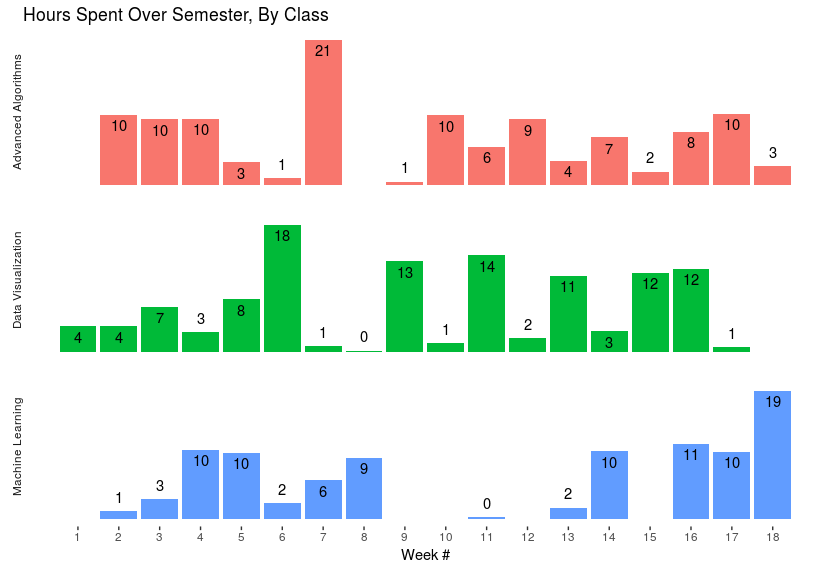
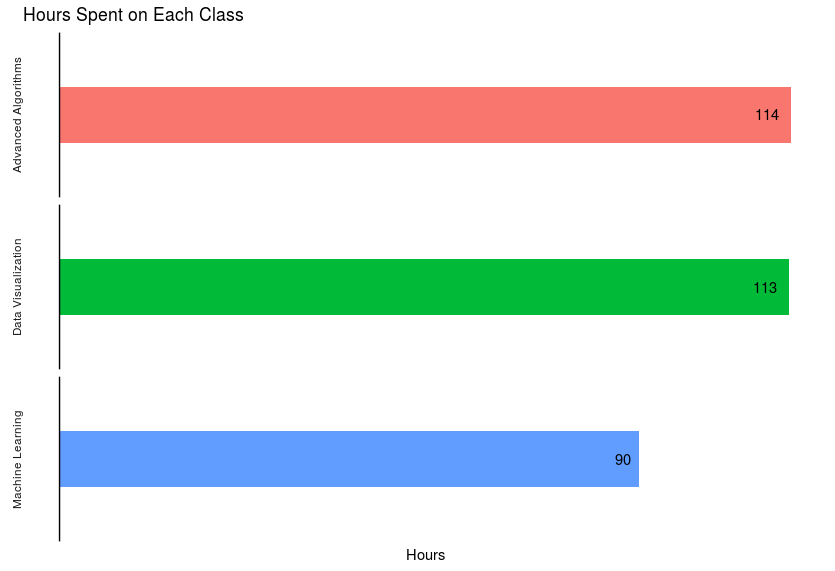
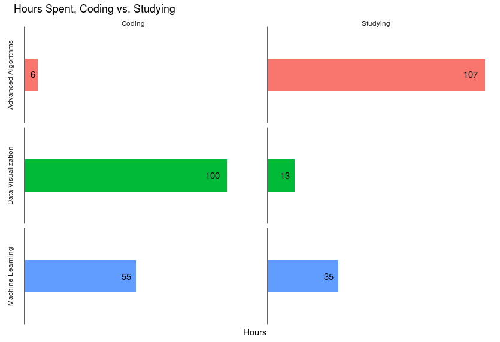
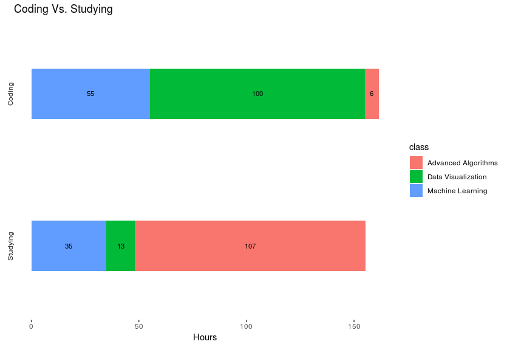

--- 

layout: default 

title:  "Family Name Overlaps" 

date:   2018-12-18 11:21:00 -0700 

published: true

categories: jekyll update 

---

# Time Spent on my Graduate Degree

I just finished my first semester of Grad School, which is exciting! Now is
a time for me to relax, reflect, and look forward to the coming semester. And
there is no better way to reflect than to pore over data that I've been tracking
meticulously since the beginning of the semester.

Yes, that's right, I have data on this semester. Specifically, I have been
keeping track of all the time I spent on Grad School homework, excluding time
spent in class. I used the Toggl app to log my time usage, and tagged each
"session" with what class I was working on, what assignment, and whether I was
coding or not.

I know that this is exciting, so let's just jump right in.

## Total Time Spent Per Week

How does Grad School compare to, say, a 40-hour work week? Well, below you can
see that the time I put into school varied quite a bit over the semester.
I rarely worked less than 10 hours total during the week. Fairly frequently,
I was spending more than 20 hours on homework. One frightful week, I spent 31
hours (fun fact: that was the week after Thanksgiving)

Remember, this data doesn't include time in classes. Including that would be an
extra 9 hours per week, so most weeks I was spending a total of 25-35 hours on
school.

 

## Hours Spent Weekly, By Class

Below the time is split out by class. Data visualization it seems like I took
every other week off. Hint: those were the weeks major deadlines were due.
Advanced algorithms, on the other hand, seems a bit more consistent from week to
week. Machine Learning, I seemed to have taken a month off, from week 9 to 13.
That was due to a) there being no homework due, and b) this being after our
midterm.

## Total Time Spent, By Class

I spent the most time on Advanced Algorithms, then Data Visualization (I only
spent 1 hour less than AA!), and finally Machine Learning.

This, of course, is not the same as perceived time. Because time spent on
Advanced Algorithms was at least 7 times as excruciating as my other two
classes.

Funnily enough, the order of which classes I spent most time on is inverse of
which classes I am most interested in. That is, I am most interested in Machine
Learning, then Data Visualization, then Advanced Algorithms. Although, I truly
did find each of them interesting and challenging.

 

## Coding vs. Not Coding

I further split the data to include whether I was "coding" or "studying", with
"studying" being any time I wasn't literally writing up code.

When you think, Masters in Computer Science, you would think most of your time
is spent coding. In reality, it's about half and half.

As shown below, I code most for Data Visualization, then Machine Learning,
followed by Advanced Algorithms. Advanced Algorithms really didn't include much
coding at all. It was reminiscent of the Defense Against the Dark Arts classes
taught by Dolores Umbridge in _Harry Potter and the Order of the Phoenix_.
Umbridge teaches the class entirely with theory, and disallows any practice or
actual use of magic, saying it is entirely unnecessary. Now, I'm not saying that
my professor tortured me (with anything other than the typical torture incident
to any Advanced Algorithms class), or that he banned us from coding (he
encouraged us to try things out! Just on our own time). All I'm saying is that
this class was all about theory, not coding!

 

## Reflections

This was a _hard_ semester for me. I had a few things riding against me:

* My undergraduate was in Economics, not CS!

* I never took Discrete Mathematics. This meant a lot of catch up in the
    beginning of the semester

* It's been two years since I was in school. It took a little while to get back
    into the swing of school life.

It was a lot of work, and at times it was intense. But I feel like I did 
well, and those things riding against me didn't hold me back nearly as much as
I thought. I would say that, at least for this semester, being good with math
was much more important than being tech savvy or being good with code.

One surprising thing: my code was as good, if not better, than a lot
of the code I saw from other CS grad students who had an undergraduate in CS.
Which was shocking to me, since I'm almost entirely self-taught, working through
personal projects, online tutorials like _Learn Python the Hard Way_ and
_Automate the Boring Stuff_, and studying things like Data Structures on my own.

I really don't say that to be prideful, but more as consolation and reality
check to anyone who is in the position I was a year or so ago, when I was
applying for CS grad schools. I was afraid that I wouldn't have what it takes to
do a CS masters, because I wasn't coding all the time. The reality is, if you're
good with math and spend some time teaching yourself some basic coding and CS
principles, you will probably be find.

Another take: if all you want to do is code, you really, really, do not need
a CS degree. Take that as you will.

Anyway, I do hope that next semester doesn't require as much work as this
semester. It was exhausting at times.
